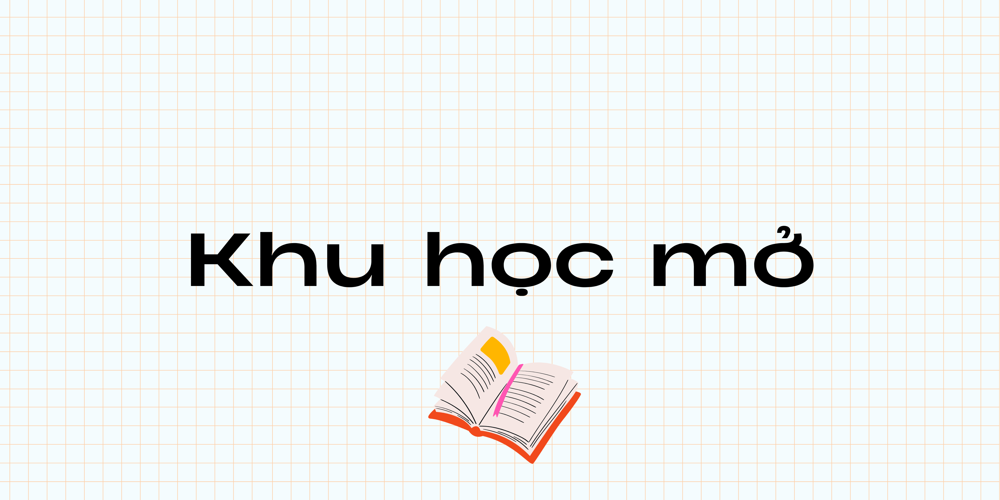

# Khu học mở - Tự học đại học

*Một chương trình hướng dẫn tự học rất nhiều ngành đại học ngay tại nhà.*

## Danh sách các chuyên ngành

- [Lịch sử](/lich-su)
- [Nhân học](/nhan-hoc)
- [Tâm lý học](/tam-ly-hoc)
- [Văn học](/van-hoc)
- [Việt Nam học](/viet-nam-hoc)
- [Xã hội học](/xa-hoi-hoc)

## Hocbigg

Nếu bạn biết Tiếng Anh và muốn học hoàn toàn bằng Tiếng Anh thì có thể thử xem [Hocbigg](https://hocbigg.github.io/)